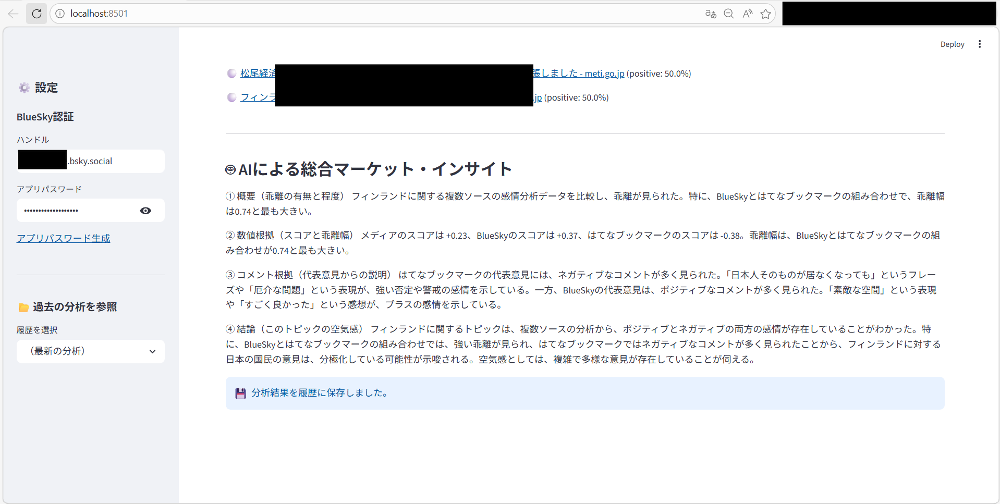
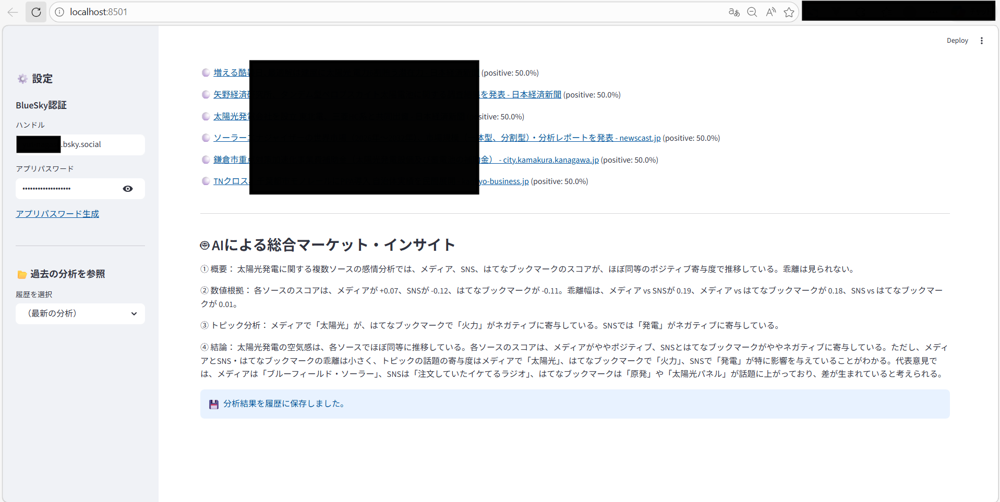
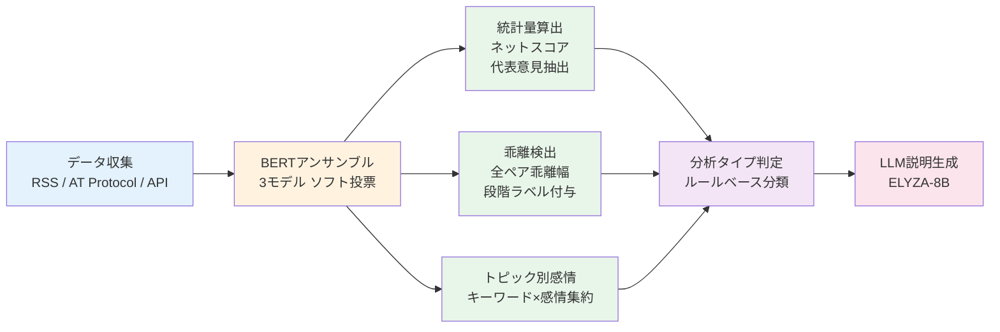
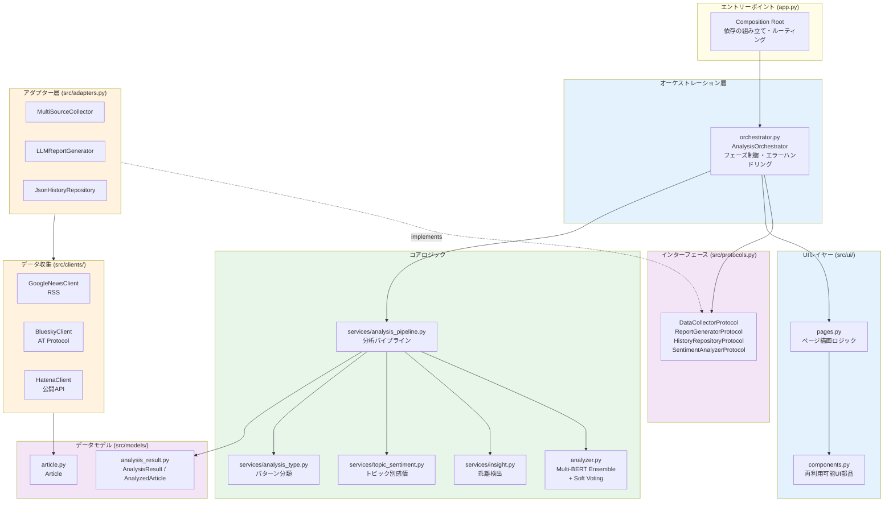

# TrendInsight AI

**多角的な視点から「世の中の空気感」を読み解くAIインサイト抽出ツール**

Googleニュース、BlueSky、はてなブックマークを横断し、メディアの報道トーンと世論の乖離をローカルLLMで分析するStreamlitアプリケーション。


## Overview

TrendInsight AIは、任意のキーワードに対して以下の3つの情報源から「空気感」を抽出し、その温度差を可視化します。

| ソース             | 性質                     | 取得方法    |
| ------------------ | ------------------------ | ----------- |
| Googleニュース     | メディア報道（公式見解） | RSS         |
| BlueSky            | SNSの生の声（感情）      | AT Protocol |
| はてなブックマーク | ナレッジ層の批判的視点   | 公開API     |

すべての処理はローカルで完結し、外部APIへのデータ送信は行いません。

## 画面イメージ

### Top、世の中の空気感


### 代表的な意見、トピック別感情分析、分析タイプ


### ワードクラウド、トレンド・キーワード TOP5


### 記事・投稿一覧、AIによる総合マーケット・インサイト



### AIによる総合マーケット・インサイト



## Key Features

- **定量的な感情分析パイプライン**
  - 複数BERT日本語モデルのアンサンブル（ソフト投票）で各記事・投稿をスコアリング
  - 単一モデル依存を排除し、異なる学習データで訓練されたモデルの合意で判定
  - ソースごとにネットスコア（positive − negative）を算出し、温度計UIで直感的に可視化
- **ソース間乖離の定量検出**
  - 全ソースペア（メディア×SNS×はてブ）の乖離幅を自動計算
  - 段階ラベル（大差なし / やや差あり / 明確な意見差 / 構造的乖離）でギャップの深刻度を明示
- **トピック別感情分析**
  - キーワード単位で感情を集約し、どの話題がポジティブ／ネガティブに寄与しているかを可視化
  - 「なぜその差が生まれているのか」を説明できる粒度の分析を提供
- **分析タイプの自動判定**
  - スコア・乖離値・トピック分布・中立率から分析パターンをルールベースで分類
  - 構造的乖離 / トピック集中型 / 中立支配 / 感情一致 / 混在型の5タイプ
  - トピック集中型は平均±1σの相対評価で判定し、データ量に依存しない安定した分類を実現
- **データドリブンなLLM総評**
  - スコア値・投稿数・乖離幅・トピック感情・分析タイプを事前計算しプロンプトに注入
  - LLMは「分析する」のではなく「データに基づいて説明する」役割に限定
  - 出力は4段構成（概要→数値根拠→トピック分析→結論）で構造化
- **代表意見の自動抽出**
  - 各ソースからpositive/negativeの最上位コメントを自動選定し、分析の根拠として表示
  - ラベルベースのフィルタリングにより、同一コメントの重複表示を防止
- **ワードクラウド**
  - メディア・SNS・はてブそれぞれの頻出語をワードクラウドとして並べて表示し、論点の違いが一目でわかる
  - メディア名・数字トークンの自動除外により、ノイズのないキーワード抽出を実現
- **過去の分析結果を再閲覧**
  - ワードクラウド画像・AI総評付きで、いつでも過去分析結果を参照できる

## Design Philosophy

本ツールの設計は以下の原則に基づいています。

1. **LLMに分析させない** — 感情スコア・乖離値・トピック感情・分析タイプはすべてコードで事前計算し、LLMには「説明」のみを担当させる。これにより出力の再現性と検証可能性を確保
2. **既存出力の組み合わせで新しい分析を生む** — トピック別感情分析は新モデル追加ゼロで実現。BERT感情ラベル × Janomeキーワードの掛け合わせという最小コストのアプローチ
3. **相対評価で閾値の脆弱性を排除** — 分析タイプ判定のトピック集中型は、固定閾値ではなく平均±1σで判定。データ量やトピック分布が変わっても安定動作
4. **外部依存ゼロ・ローカル完結** — 有料API不要、データ外部送信なし。個人開発者が継続運用できるアーキテクチャ
5. **ProtocolベースのDIによるテスト容易性** — オーケストレーターは具象クラスに依存せず、Protocolインターフェースのみに依存。テスト時はモック注入だけでLLM/ネットワーク/ファイルI/O不要
6. **エラーのユーザビリティ** — カスタム例外階層で「何が起きたか」と「何をすべきか」を明示。技術的詳細はログファイルに記録し、画面には出さない

## Analysis Pipeline

本ツールの分析は以下の多段パイプラインで構成されており、LLMは最終段の「説明」のみを担当します。



| 処理段階         | 担当                            | 出力                          |
| ---------------- | ------------------------------- | ----------------------------- |
| 感情スコアリング | BERTアンサンブル（3モデル加重平均） | 各記事のpositive/negative確率 |
| 統計集約         | コード（ルールベース）          | ソース別ネットスコア、中立率  |
| 乖離検出         | コード（ルールベース）          | ペア別乖離幅 + 段階ラベル     |
| トピック別感情   | コード（キーワード×ラベル集約） | 話題単位のネットスコア        |
| 分析タイプ判定   | コード（統計的ルール）          | パターン分類 + 判定理由       |
| 代表意見選定     | コード（Top-K抽出）             | pos/neg各1件×ソース数         |
| 総評生成         | LLM（ELYZA-8B）                 | 上記データを引用した説明文    |

## Analysis Type Classification

分析結果に「意味」を付与するルールベースのパターン分類システムです。

| タイプ                | 条件                                       | 意味                               |
| --------------------- | ------------------------------------------ | ---------------------------------- |
| 🔥 構造的乖離         | 最大乖離 > 0.5 かつ ソース間で評価方向が逆 | メディアと世論で認識が真逆         |
| ⚡ トピック集中型ネガ | トピックスコアが平均 - 1σ未満              | 特定話題がネガティブ文脈で多く出現 |
| 🌟 トピック集中型ポジ | トピックスコアが平均 + 1σ超                | 特定話題がポジティブ文脈で多く出現 |
| ⚪ 中立支配           | 全ソースのneutral > 60%                    | 明確な評価が少ない（様子見）       |
| 🤝 感情一致           | 全ソース同方向 かつ 最大乖離 < 0.2         | 全ソースで意見が一致               |
| 🔀 混在型             | 上記いずれにも非該当                       | 複合的な状態                       |

## Architecture

本プロジェクトはクリーンアーキテクチャの原則に基づき、以下のレイヤー構成を採用しています。



### レイヤー間の依存方向

- **オーケストレーター** → Protocol（インターフェース）にのみ依存
- **アダプター** → Protocolを実装し、具象ライブラリ（clients, reporter, history）をラップ
- **app.py（Composition Root）** → 具象クラスを生成してオーケストレーターに注入

この構成により、テスト時はモック実装を注入するだけで、Streamlit/LLM/ネットワーク/ファイルI/O無しにロジックを検証できます。

## Getting Started

### Prerequisites

- Python 3.12+
- RAM 12GB以上（LLM推論で使用）
- ディスク空き容量 6GB以上（モデルファイルの保存先として必要）

### Installation

```bash
git clone https://github.com/YOUR_USERNAME/trend-insight-ai.git
cd trend-insight-ai

# uv (推奨)
uv sync

# pip の場合
python -m venv .venv
source .venv/bin/activate  # Windows: .venv\Scripts\activate
pip install -r requirements.txt

# pipからuvに切り替える場合
rm -rf .venv
uv sync
```

### Configuration

BlueSky連携を有効にする場合、`.env`ファイルを作成します。

```bash
cp .env.example .env
```

```env
BLUESKY_HANDLE=yourname.bsky.social
BLUESKY_APP_PASSWORD=your-app-password
```

**BlueSky App Passwordの取得方法**

1. https://bsky.app にログイン
2. 設定 → アプリパスワード → 「アプリパスワードを追加」
3. 生成されたパスワードを`.env`に記入

> BlueSky未設定でもメディア＋はてなブックマークの2ソース分析は動作します。

### Run

```bash
# uv
uv run streamlit run app.py

# pip
streamlit run app.py
```

初回起動時にELYZA-8Bモデル（約4.5GB）が自動ダウンロードされます。

## Tech Stack

| Layer                  | Technology                                                   |
| ---------------------- | ------------------------------------------------------------ |
| UI                     | Streamlit                                                    |
| Sentiment Analysis     | transformers + 複数BERTモデルアンサンブル（koheiduck / christian-phu / llm-book） |
| Morphological Analysis | Janome                                                       |
| Word Cloud             | wordcloud                                                    |
| LLM Inference          | llama-cpp-python + ELYZA-JP-8B (Q4_K_M GGUF)                 |
| Data Collection        | feedparser / atproto / requests                              |

各技術の詳細は [docs/](docs/) を参照してください。

## Project Structure

```
trend_insight_ai/
├── app.py                     # エントリーポイント (Composition Root)
├── src/
│   ├── orchestrator.py        # 分析フロー制御 (AnalysisOrchestrator)
│   ├── protocols.py           # DI用Protocolインターフェース定義
│   ├── adapters.py            # Protocol具象実装 (Collector/Reporter/History)
│   ├── exceptions.py          # カスタム例外階層 (user_message + user_hint)
│   ├── analyzer.py            # SentimentAnalyzer (Multi-BERT ensemble + soft voting)
│   ├── reporter.py            # LLM-based insight generation
│   ├── clients/               # データ収集クライアント
│   │   ├── base.py            # BaseClient abstract class
│   │   ├── google_news.py
│   │   ├── bluesky.py
│   │   └── hatena.py
│   ├── models/
│   │   ├── article.py         # Pydantic Article model
│   │   └── analysis_result.py # 分析結果の型定義 (AnalysisResult等)
│   ├── services/
│   │   ├── analysis_pipeline.py   # 感情分析→統計量算出パイプライン
│   │   ├── analysis_type.py       # Rule-based pattern classification
│   │   ├── history.py             # Analysis history persistence
│   │   ├── insight.py             # Rule-based gap detection
│   │   ├── text_processor.py      # Keyword extraction (with noise filtering)
│   │   ├── topic_sentiment.py     # Topic-level sentiment aggregation
│   │   └── wordcloud_generator.py
│   └── ui/
│       ├── components.py      # 再利用可能なUI描画部品
│       └── pages.py           # ページ単位の描画ロジック
├── tests/                     # pytest test suite
├── data/                      # Auto-generated (gitignored)
│   └── logs/                  # アプリケーションログ (日付ローテーション)
├── models/                    # Auto-downloaded GGUF (gitignored)
├── pyproject.toml             # Dependency management (uv)
├── uv.lock                    # Reproducible lock file
└── .env.example
```

## License

[MIT](LICENSE)
