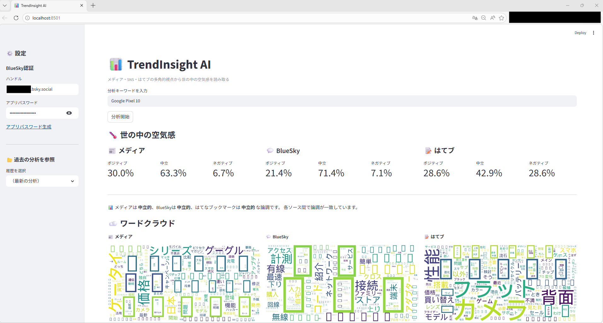
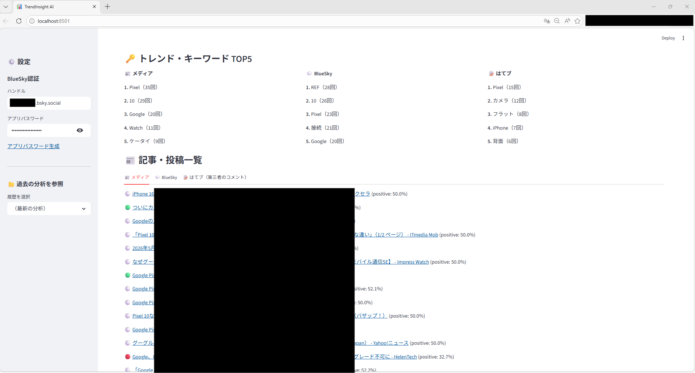
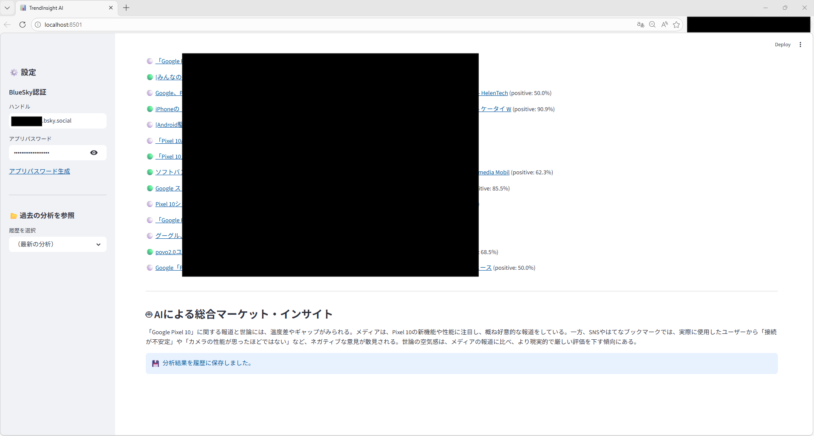

# TrendInsight AI

**多角的な視点から「世の中の空気感」を読み解くAIインサイト抽出ツール**

Googleニュース、BlueSky、はてなブックマークを横断し、メディアの報道トーンと世論の乖離をローカルLLMで分析するStreamlitアプリケーション。


## Overview

TrendInsight AIは、任意のキーワードに対して以下の3つの情報源から「空気感」を抽出し、その温度差を可視化します。

| ソース             | 性質                     | 取得方法    |
| ------------------ | ------------------------ | ----------- |
| Googleニュース     | メディア報道（公式見解） | RSS         |
| BlueSky            | SNSの生の声（感情）      | AT Protocol |
| はてなブックマーク | ナレッジ層の批判的視点   | 公開API     |

すべての処理はローカルで完結し、外部APIへのデータ送信は行いません。

## 画面イメージ

### Topからワードクラウドまで



### トレンド・キーワード TOP5 から記事・投稿一覧まで



### AIによる総合マーケット・インサイト



## Key Features

- **多方面データを使用した感情分析**
  - BERT日本語モデル（positive/neutral/negativeの3クラス分類）で、Googleニュース、BlueSky、はてなブックマークの論調を数値化
- **LLMによる総評出力**
  - ELYZA-8B Q4_K_M量子化モデルで総評レポートを生成。外部APIへの送信なし、費用ゼロ
- **ワードクラウド**
  - メディア・SNS・はてブそれぞれの頻出語をワードクラウドとして並べて表示し、論点の違いが一目でわかる
- **メディアと世論のギャップ検出**
  - ルールベース＋LLMで「報道と実感のズレ」を自動的に言語化
- **過去の分析結果を再閲覧**
  - ワードクラウド画像・AI総評付きで、いつでも過去分析結果を参照できる

## Architecture

```
┌─────────────────────────────────────────────────┐
│                  Streamlit UI                     │
├─────────────────────────────────────────────────┤
│  src/collector.py    │  src/analyzer.py          │
│  - Google News RSS   │  - BERT Sentiment (3cls)  │
│  - BlueSky (atproto) │  - Negative Dict Boost    │
│  - Hatena Bookmark   │  - Janome Tokenizer       │
├──────────────────────┼──────────────────────────┤
│  src/reporter.py                                 │
│  - ELYZA-8B GGUF (llama-cpp-python)             │
│  - Structured Prompt → 3-5 line Insight          │
├─────────────────────────────────────────────────┤
│  data/                                           │
│  - analysis_history.json                         │
│  - images/wordcloud_*.png                        │
└─────────────────────────────────────────────────┘
```

## Getting Started

### Prerequisites

- Python 3.12+
- RAM 12GB以上（LLM推論で使用）
- ディスク空き容量 6GB以上（モデルファイルの保存先として必要）

### Installation

```bash
git clone https://github.com/YOUR_USERNAME/trend-insight-ai.git
cd trend-insight-ai

python -m venv .venv
source .venv/bin/activate  # Windows: .venv\Scripts\activate

pip install -r requirements.txt
```

### Configuration

BlueSky連携を有効にする場合、`.env`ファイルを作成します。

```bash
cp .env.example .env
```

```env
BLUESKY_HANDLE=yourname.bsky.social
BLUESKY_APP_PASSWORD=your-app-password
```

**BlueSky App Passwordの取得方法**

1. https://bsky.app にログイン
2. 設定 → アプリパスワード → 「アプリパスワードを追加」
3. 生成されたパスワードを`.env`に記入

> BlueSky未設定でもメディア＋はてなブックマークの2ソース分析は動作します。

### Run

```bash
streamlit run app.py
```

初回起動時にELYZA-8Bモデル（約4.5GB）が自動ダウンロードされます。

## Tech Stack

| Layer                  | Technology                                                   |
| ---------------------- | ------------------------------------------------------------ |
| UI                     | Streamlit                                                    |
| Sentiment Analysis     | transformers + `koheiduck/bert-japanese-finetuned-sentiment` |
| Morphological Analysis | Janome                                                       |
| Word Cloud             | wordcloud                                                    |
| LLM Inference          | llama-cpp-python + ELYZA-JP-8B (Q4_K_M GGUF)                 |
| Data Collection        | feedparser / atproto / requests                              |

各技術の詳細は [docs/](docs/) を参照してください。

## Project Structure

```
trend_insight_ai/
├── app.py                 # Main Streamlit application
├── src/
│   ├── analyzer.py        # Sentiment analysis (BERT + dictionary boost)
│   ├── collector.py       # Data collection (News, BlueSky, Hatena)
│   └── reporter.py        # LLM-based insight generation
├── data/                  # Auto-generated (gitignored)
│   ├── analysis_history.json
│   └── images/
├── models/                # Auto-downloaded GGUF (gitignored)
├── .env.example
├── .gitignore
└── requirements.txt
```

## License

[MIT](LICENSE)
